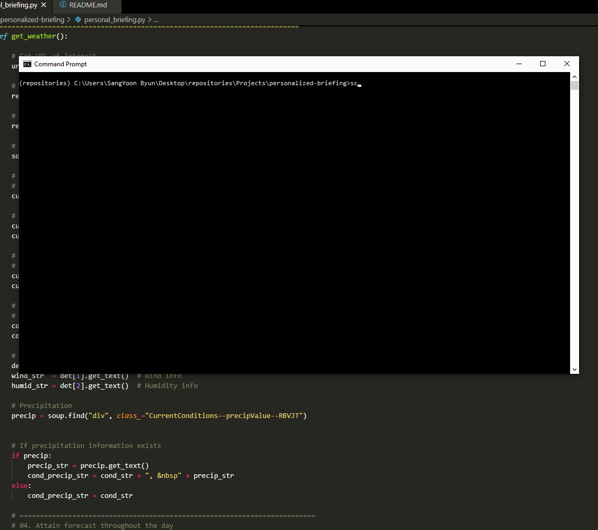

# personalized-briefing

## Description

Personalized-briefing is a program that uses web-scraping tools to extract specific information from several websites and display in HTML format. It uses the requests and beautifulsoup module to make HTML requests and parse the HTML components to attain the desired information on websites. While this program can be customized based on user preferences, it currently collects four main types of information--weather forecasts, COVID-19 cases, U.S. News, and World News.

The weather section includes information like temperature and precipitation forecasts and are all gathered from [weather.com](http://weather.com), specifically focused on Grinnell, Iowa (where I am at the moment). The COVID-19 section includes COVID-19 updates in Iowa as well as its neighboring states from a special section in the New York Times. The U.S. News and World News section attains the top three headline news from [New York Times](https://www.nytimes.com/) and [BBC World News](https://www.bbc.com/news/world), respectively.

All scraped and gathered information are then organized into an HTML format, making it easier and more comfortable to read. The batch file (script.bat), once executed, will begin to collect all these information and open the generated HTML file in a web browser.

## Installation

I used the requests module (version 2.24.0) to make HTML requests

```bash
pip install requests
```

I also installed beautiful soup module (version 4.9.3) to parse the attained HTML components

```bash
pip install beautifulsoup4
```

## Usage

Clone the personalized-briefing repository in your directory.

```bash
git clone https://github.com/byunsy/personalzied-briefing.git
```

Move to your specific directory and execute the batch file.

```bash
script.bat
```

## Demonstrations

The program collects weather, COVID-19, U.S. News, and World News information from different websites.


